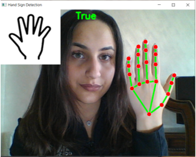
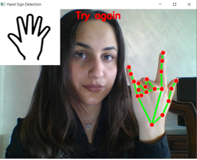
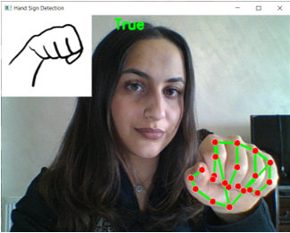
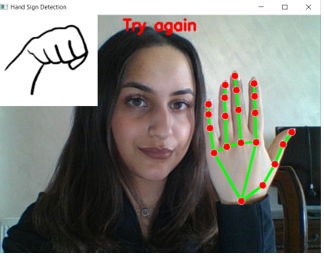
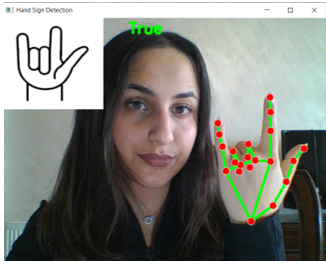
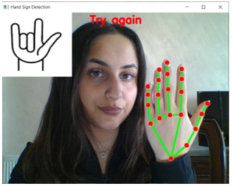
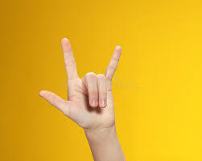
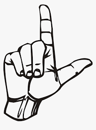

# Finger Speak
Sign Language Translating and Teachhing Application using OpenCV

## Introduction
Sign language is one of the most important and natural communication modalities. It is a static expression system that is composed of signs by usinghand motion aided by facial expressions. Sign language is mainly employed by hearing-impaired people to communicate with each other. However, communication with normal people is a major handicap for them since normal people do not understand their sign language.
FingerSpbasically uses the approach of computer vision-based gesture recognition.
in which a camera is used as input and image are captured in the form of image frame then translating the sign and showing the user it's meaning.

Such a application would greatly lower the barrier for many people with special needs to be able to better communicate with others in day to day interactions.

Identification of sign gesture is mainly performed by the Vision-based method, further classified into static and dynamic recognition. Statics deals with the detection of static gestures(2d-images) while dynamic is a real-time live capture of the gestures. This involves the use of the camera for capturing movements.

## Goal
The goal of this project was to build a robast application that allows users to learn and translate sign language in real time.

## Objectives
Producing a model which can recognize fingerspelling based on hand gestures in order to form a complete word.

## Keywords
Hand Gesture, Computer Vision, Opencv, Hand Detection, Voice Recognition

## Problem Domain
The special needs community is growing due to many factors; they have already exceeded 400 million worldwide. And to help them blend and contribute to their societies, "Sign Language" is their tool for direct communication with others. The dilemma is that only 1% of the world population has acquired the language, and can reach those challenged individuals. So, with tech field advancement there are many attempts to come up with solutions to overcome the communication issue and to help more people learn the language and reach to the special community. The project at hand presents one of those attempts.
The project is to develop an open-source desktop app to help whoever is in need / like to learn the sign language in an advanced and interactive approach. With a user-friendly interface, it's possible to learn some basic expressions to contact the special needs using only a web cam and live feedback to train and evaluate the learning process.

## Use Cases Diagram

## Workflow/Activity Diagram
<!-- Add workflow picture (Ghaida) -->

## User Interface Desigm and Manual

### Hello Sign 
**Success**

The sign is practiced correctly

**Try Again**

The sign is practiced incorrectly

### Yes Sign 
**Success**

The sign is practiced correctly

**Try Again**

The sign is practiced incorrectly

### I love you Sign 
**Success**

The sign is practiced correctly

**Try Again**

The sign is practiced incorrectly

**Leave or Exit the practice or translate**

**Leave or Exit the volume control**

    Press Esc key
## Libraries

**OpenCV**

OpenCV-Python is a library of Python bindings designed to solve computer vision problems.
    
    Installation: pip install opencv-python
    Import: import cv2

**Mediapipe**
MediaPipe is Google's open-source framework, used for media processing

    Installation: pip install mediapipe
    Import: import mediapipe

**Pyttsx3**
Pyttsx3 is a text-to-speech conversion library in Python

    Installation: pip install pyttsx3
    Import: import pyttsx3

**Numpy**
NumPy is a Python library used for working with arrays. It also has functions for working in domain of linear algebra, fourier transform, and matrices.

    Installation: pip install numpy 
    Import: import numpy

## Project Tree

    ├───.idea
    │   └───inspectionProfiles
    ├───finger_speak
    |   ├───images
    |   ├───app_finger_speak.py
    |   ├───hand_detect.py
    |   ├───practice.py
    |   └───volume_control.py
    ├───tests
    |   ├───test_finger_speak.py  
    ├───venv  
    ├───README.md

## Functional description and overview
### Describe the functionalities
#### SignDetection Class

    A class that detects the hand landmarks.
        Translate the landmarks into a specific american sign language using the coordinates of each finger's landmark
        Translate the sign language to voice record
        Translate the sign language to an image
**hand_detection method**

    A method that is used for detecting the landmarks for the fingers and translates it to sign language using the x and y coordinates
        Arguments: None
        Returns: Displays the hand landmarks, image, text and voice for each sign language

**quitter method**

    A method that is used to quit the camera when esc key is pressed by the user
        Arguments: None
        Returns: Quits the camera
    (for the TK)

**most_frequent method**

    A method to detect the most repeated sign language
        Arguments: None
        Returns: None , edit the value of the self.common

**text_output method**

    A method to print the text, then print the user knowledge stats for than word (if he knows it or not)
        Arguments: None
        Return: print the word and (You learned it/This word is new to you)

**voice_output method**

    A method that is used to translate the text to voicerecord
        Arguments: word
        Returns: Displays or Plays the voicerecord

#### SignPractice Class

    A class that detects the hand landmarks.
        Translate the landmarks into a specific american sign language using the coordinates of each finger's landmark
        Translate the sign language to voice record
        Translate the sign language to an image

**hand_detection method**

    A method that is used for detecting the landmarks for the fingers and translates it to sign language using the x and y coordinates
        Arguments: None
        Returns: Displays the hand landmarks, image, text and voice for each sign language

**most_frequent method**

    A method to detect the most repeated sign language
        Arguments: None
        Returns: None , edit the value of the self.common

**add_to_learned method**

    Add the learned word to database
        Arguments: None
        Returns: side effect, change the value for the word to be True(learned)

**learned method**

    To enquire if the user learned the word before or not
        Arguments: word
        Returns: True if the user learned it before, False if not

#### HandSignDetector Class

    A class used to detect the hand landmarks of the hands
    Translates the landmarks to a specific feature

**find_hands method**

    A method that is used to detect the hands
        Arguments: img, draw
        Returns: img

**find_position method**

    A method that is used to detect position of all the landmarks in the hand
        Arguments: img, hand_no=0, draw
        Returns: landmarks_list

**gesture_volume function**

    A function used to contol the volume of the sound
        Arguments: None
        Returns: Increases or Decreases the sound

## Testing and Monitoring

- Test camera

    The test check if the camera is opened or not

    Returns: True if the camera is opened False if not

- Test 21 landmarks:

    The "hand_detection" function should detect 21 landmarks for the hands on each frame 

     

- Test sign detection (all words): 

    The test check if the Sign detection class can read hand signs and return the right word.

    Sample: 

    

    For this image the expected is the word "I LOVE YOU"

- Test (L) leave sign successfully exists the program

    This test check if the hand_detection function stops correctly after a leave sign is detected.

    Sample:

    

    After aplying this sign the hand_detection function stops

## Stretch goals for the project
- Currently the training & modeling is based on static datasets of sign-reading images. The future step up would be to involve machine learning so the training datasets keeps expanding with every use of the software, and hence, the accuracy of the images processing would improve.
- Images processing accuracy could also be developed by collecting feedback by the user on wrong readings.

## Team Members
- Ghaida Al Momany
- Moayad Abukhadra
- Emad Almajdalawi
- Raghad Abdulhadi
- Suhaib Ahmad

## Resources 
1.	OpenCV Documentation, https://docs.opencv.org/4.x/ 
2.	mediapipe / hands Documentation, https://google.github.io/mediapipe/solutions/hands#python-solution-api 
3.	TKinter Documentation, https://docs.python.org/3/library/tk.html
4.	Pillow Documentation, https://pillow.readthedocs.io/en/stable/handbook/index.html
5.	Pyttsx Documentation, https://pyttsx3.readthedocs.io/en/latest/ 
6.	https://visualtk.com/ 
7.	https://www.activestate.com/resources/quick-reads/how-to-add-images-in-tkinter/ 
8.	https://stackoverflow.com/questions/10133856/how-to-add-an-image-in-tkinter