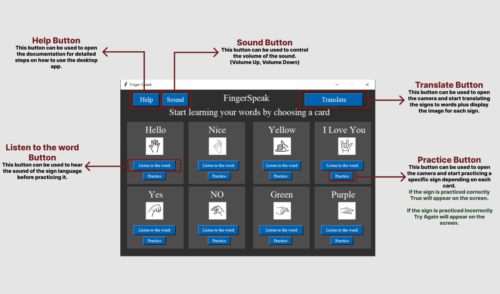
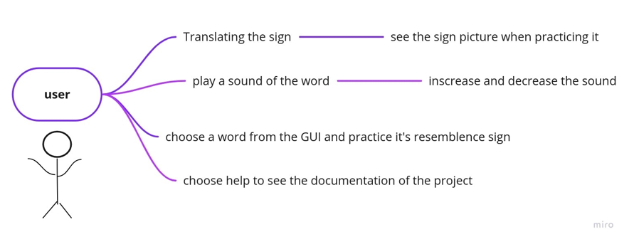
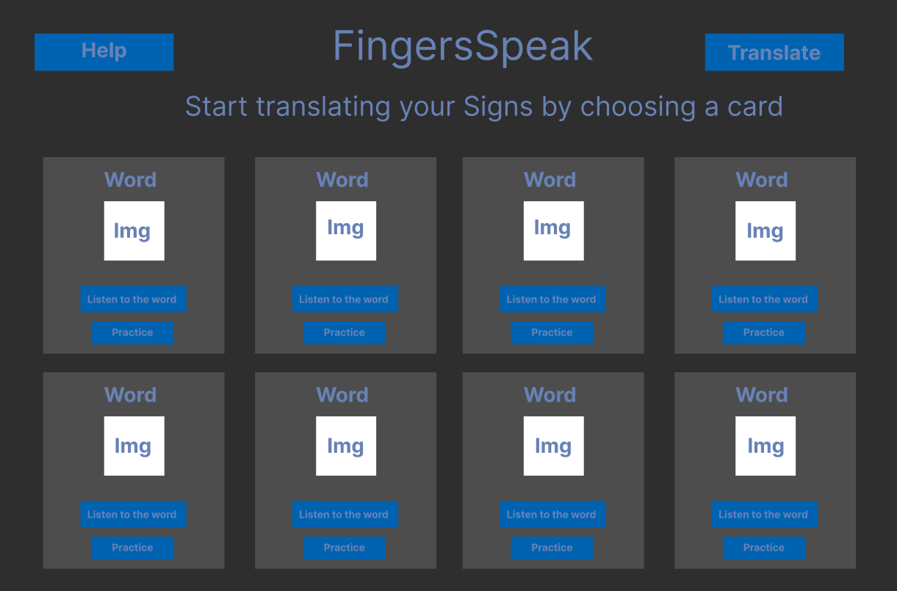

# Finger Speak
Sign Language Translating and Teachhing Application using OpenCV

## Introduction
Sign language is one of the most important and natural communication modalities. It is a static expression system that is composed of signs by usinghand motion aided by facial expressions. Sign language is mainly employed by hearing-impaired people to communicate with each other. However, communication with normal people is a major handicap for them since normal people do not understand their sign language.
FingerSpbasically uses the approach of computer vision-based gesture recognition.
in which a camera is used as input and image are captured in the form of image frame then translating the sign and showing the user it's meaning.

Such a application would greatly lower the barrier for many people with special needs to be able to better communicate with others in day to day interactions.

Identification of sign gesture is mainly performed by the Vision-based method, further classified into static and dynamic recognition. Statics deals with the detection of static gestures(2d-images) while dynamic is a real-time live capture of the gestures. This involves the use of the camera for capturing movements.

## Keywords:
Hand Gesture, Computer Vision, Opencv, Hand Detection, Voice Recognition

## Goal
The goal of this project was to build a robast application that allows users to learn and translate sign language in real time.

## Objectives
Producing a model which can recognize fingerspelling based on hand gestures in order to form a complete word.

## Problem Domain
Deaf people are and existential part of our community, Their language "Sign language" is important and used
by 70 million deaf human around the world and only 1% of of the population uses the sign language. So as the Tech field develop we have to discover easier and more efficient ways to learn their language
and communicate with them. This will made them happier and more involved which means a happier community.
In our project we developed a tool to help users learn and translate sign language in real time manner.

## Functional description and overview
### Describe the functionalities
<!-- Hand Detection, landmarks, signs, volume -->

## Libraries

**OpenCV**

OpenCV-Python is a library of Python bindings designed to solve computer vision problems.
    
    Installation: pip install opencv-python
    Import: import cv2

**Mediapipe**
MediaPipe is Google's open-source framework, used for media processing

    Installation: pip install mediapipe
    Import: import mediapipe

**Pyttsx3**
Pyttsx3 is a text-to-speech conversion library in Python

    Installation: pip install pyttsx3
    Import: import pyttsx3

**Numpy**
NumPy is a Python library used for working with arrays. It also has functions for working in domain of linear algebra, fourier transform, and matrices.

    Installation: pip install numpy 
    Import: import numpy

## User Interface Desigm and Manual

## Use Cases Diagram

## Workflow/Activity Diagram
<!-- Add workflow picture (Ghaida) -->

## Wireframe

## Testing and Monitoring
<!-- Explantion on how the testing process works (Moayad)-->
- Test camera
- Test 21 landmarks
- Test sign detection (all words)
- Test (L) leave sign successfully exists the program
- Test voice translation

## Stretch goals for the project
- Currently the training & modeling is based on static datasets of sign-reading images. The future step up would be to involve machine learning so the training datasets keeps expanding with every use of the software, and hence, the accuracy of the images processing would improve.
- Images processing accuracy could also be developed by collecting feedback by the user on wrong readings.

## Resources 
1.	OpenCV Documentation, https://docs.opencv.org/4.x/ 
2.	mediapipe / hands Documentation, https://google.github.io/mediapipe/solutions/hands#python-solution-api 
3.	TKinter Documentation, https://docs.python.org/3/library/tk.html
4.	Pillow Documentation, https://pillow.readthedocs.io/en/stable/handbook/index.html
5.	Pyttsx Documentation, https://pyttsx3.readthedocs.io/en/latest/ 
6.	https://visualtk.com/ 
7.	https://www.activestate.com/resources/quick-reads/how-to-add-images-in-tkinter/ 
8.	https://stackoverflow.com/questions/10133856/how-to-add-an-image-in-tkinter