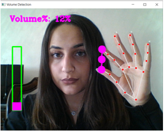
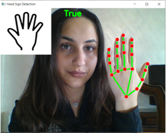
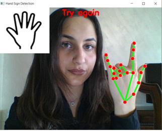
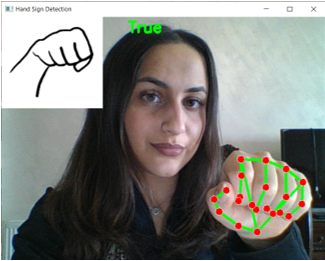
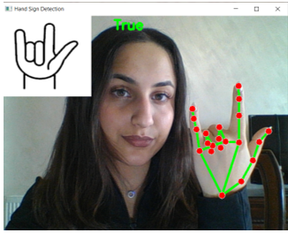
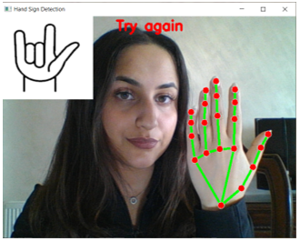
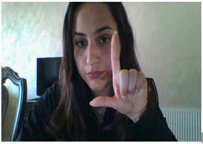

# Software user guide 

# Help button 
This button will move you to the documentation and this user guide, in order to  learn how to use the application and fix issues.

# Sound Button 
**you can control your system sound by using this button.** 

###  The button will show the camera window and you can move your finger in a way that the space between them arises to raise the volume and decrease the space to lower the volume as shown the in  below pictures.

### increase the vloume 

### decrease the vloume 

# Translate button 
using this button allows you to open the camera and start showing hand gestures to translate them, it also has the feature of showing you a picture of the sign in the top corner of the window as shown below

# Cards 
**In the next section of the application interface you can see a card for a multiple signs and gestues each card has:**
* the name of the sign 
* a picture of the sign 
* a button that allows you to hear a sound of the word 
* a button that allows you to try demonstrating the sign 

## here you can refer to the name and the picture of the sign

## here you can refer to the name and the buttons of each sign

**In the pracice button you can practice each sign and the camera window shows you a picture of the sign and a feedback if you get the sign right or you should try again.**

### Hello Sign 
**Success**

The sign is practiced correctly

**Try Again**

The sign is practiced incorrectly

### Yes Sign 
**Success**

The sign is practiced correctly

**Try Again**

The sign is practiced incorrectly

### I love you Sign 
**Success**

The sign is practiced correctly

**Try Again**

The sign is practiced incorrectly

**Leave or Exit the practice or translate**

**Leave or Exit the volume control**

   Press Esc key